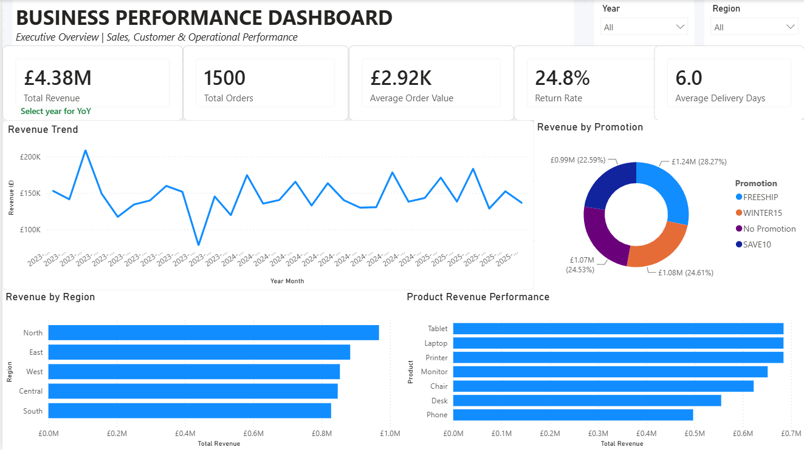
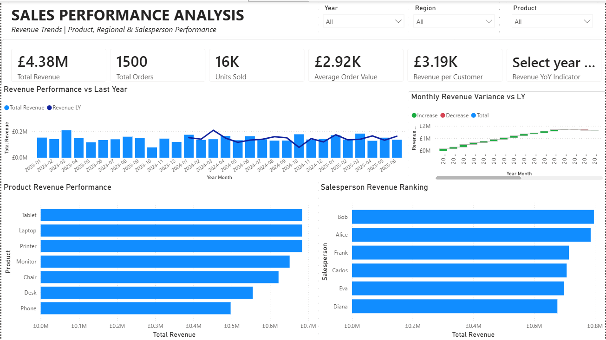
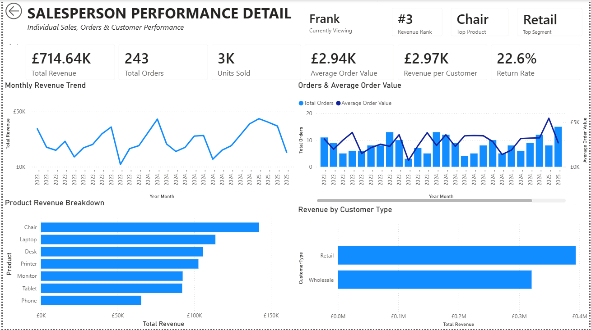

# Sales & Business Performance Dashboard

**Power BI | DAX | Power Query | Data Modelling | Business Intelligence**

An interactive Power BI solution designed to analyse business performance across revenue, products, regions, promotions and sales performance.

The report provides three levels of analysis: an executive overview of company performance, detailed sales analysis, and salesperson-level drill-through reporting.

---

## Project Overview

The objective of this project was to transform transactional sales data into a structured business intelligence solution that enables users to monitor performance, identify trends and investigate the drivers behind revenue.

The dashboard was designed around three analytical levels:

1. **Executive Overview** – high-level business performance
2. **Sales Performance Analysis** – product, regional, temporal and salesperson analysis
3. **Salesperson Performance Detail** – individual salesperson investigation through drill-through

## Executive Overview

The Executive Overview provides a consolidated view of overall business performance.

Key metrics include:

- Total Revenue
- Total Orders
- Average Order Value
- Return Rate
- Average Delivery Days
- Revenue by Region
- Revenue by Promotion
- Product Revenue Performance
- Monthly Revenue Trend

Interactive Year and Region filters allow performance to be analysed across different periods and geographical areas.




## Sales Performance Analysis

The Sales Performance page provides a deeper view of the factors driving overall revenue.

The analysis includes:

- Revenue performance over time
- Current vs previous-year revenue
- Year-over-Year revenue change
- Monthly revenue variance
- Product revenue performance
- Salesperson revenue ranking
- Dynamic Year, Region and Product filtering

DAX measures were used to create previous-year comparisons, dynamic KPIs and salesperson rankings that respond to the active filter context.




## Salesperson Performance Detail

A dedicated drill-through page enables individual salesperson performance to be investigated directly from the wider sales analysis.

The page dynamically displays:

- Revenue and revenue ranking
- Total orders
- Units sold
- Average Order Value
- Revenue per Customer
- Return Rate
- Top-performing Product
- Top Customer Segment
- Monthly Revenue Trend
- Product Revenue Breakdown
- Customer Segment Revenue
- Order Volume and Average Order Value trends

This provides a transition from company-level reporting to individual performance analysis without requiring separate reports.




## Business Questions

The report was designed to answer several business questions:

- How is revenue changing over time?
- Which regions contribute the most revenue?
- Which products are the strongest revenue drivers?
- How does current performance compare with the previous year?
- Which salespeople generate the most revenue?
- What factors contribute to differences in salesperson performance?
- How is revenue distributed across customer segments?
- How do promotions contribute to revenue?
- What are the current return and delivery performance levels?

## Key Findings

Analysis of the complete dataset identified several notable findings:

- Total revenue reached approximately **£4.38M across 1,500 orders**.
- The **North region** generated the highest overall revenue, approaching **£1M**.
- **Tablet, Laptop and Printer** were the strongest products by overall revenue.
- Revenue was distributed relatively evenly across the available promotional categories rather than being concentrated in a single promotion.
- Salesperson performance differed considerably across revenue, product mix, customer segments and return rates.
- Drill-through analysis made it possible to investigate these differences at individual salesperson level rather than relying solely on aggregate rankings.


## Technical Implementation

### Data Preparation
Power Query was used to prepare the transactional dataset for analysis and reporting.

### Data Model
The report was structured to support time-based analysis, interactive filtering and dynamic calculations across the dashboard.

### DAX
Measures were developed for calculations including:

- Total Revenue
- Total Orders
- Units Sold
- Average Order Value
- Revenue per Customer
- Return Rate
- Average Delivery Days
- Previous Year Revenue
- Year-over-Year Performance
- Salesperson Revenue Rank
- Top Product
- Top Customer Segment

### Interactivity
The report incorporates:

- Dynamic slicers
- Cross-filtering
- Drill-through navigation
- Dynamic KPI calculations
- Previous-year comparisons
- Ranking measures
- Conditional performance indicators


## Tools & Skills

**Tools:** Power BI Desktop, Power Query, DAX

**Skills demonstrated:** Data Cleaning, Data Modelling, KPI Development, Time Intelligence, Business Analysis, Data Visualisation, Interactive Reporting, Drill-through Analysis


## Repository Structure

```text
sales-business-performance-powerbi/
│
├── screenshots/
│   ├── executive-overview.png
│   ├── sales-performance.png
│   └── salesperson-detail.png
│
├── Sales-Business-Performance-Dashboard.pbix
└── README.md
